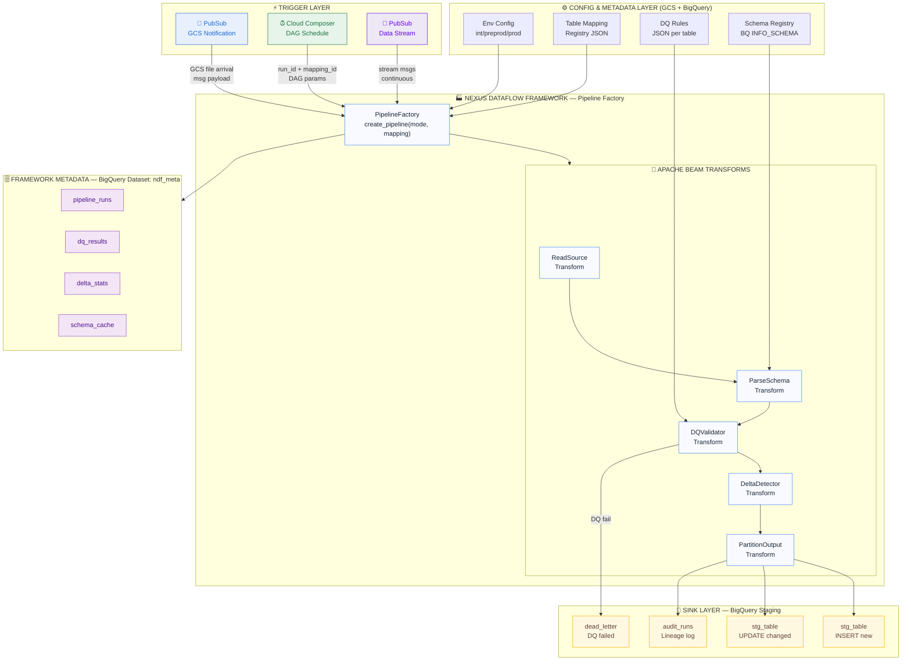
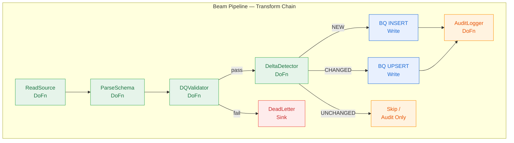
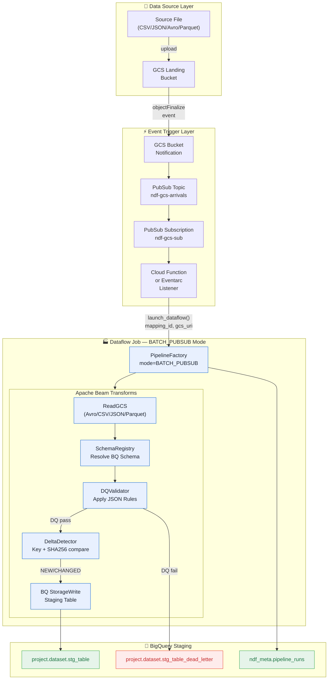
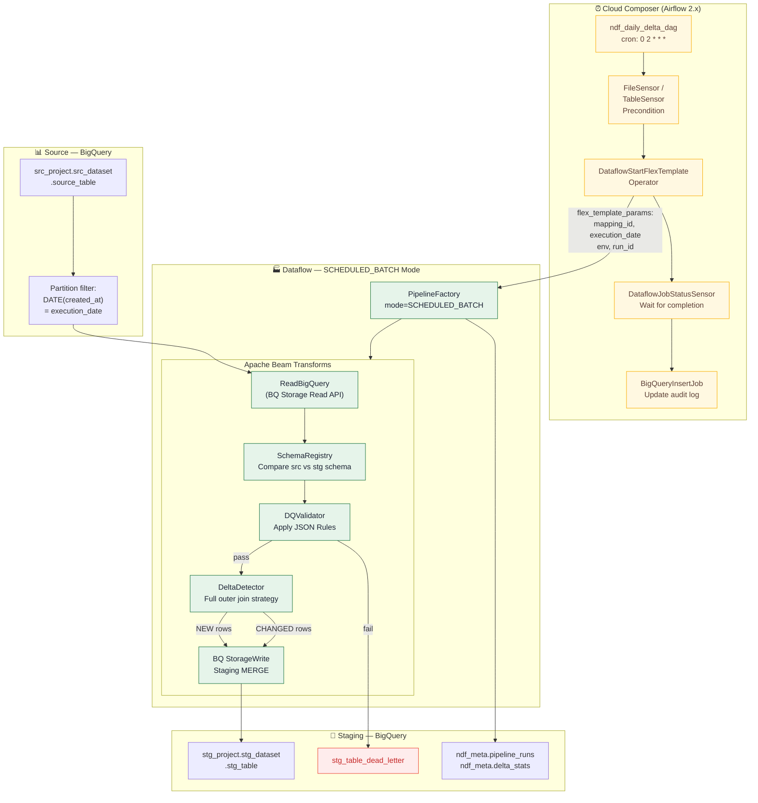
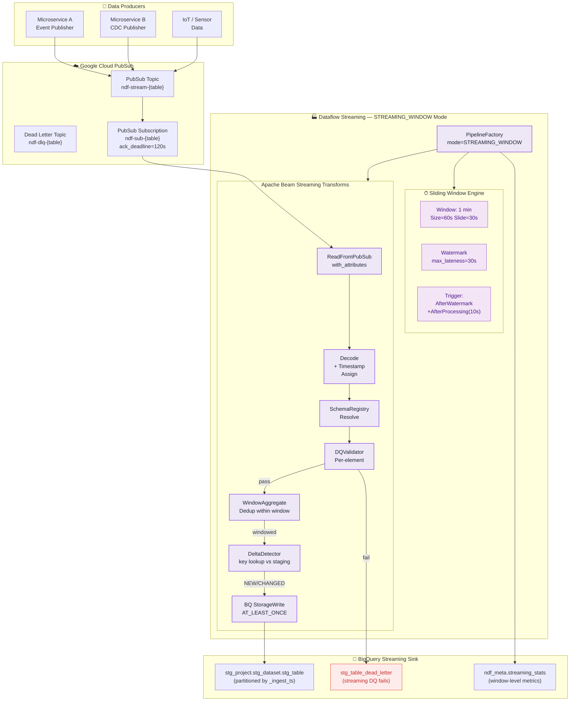
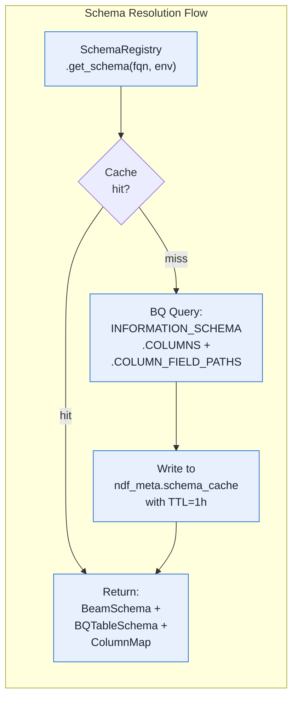
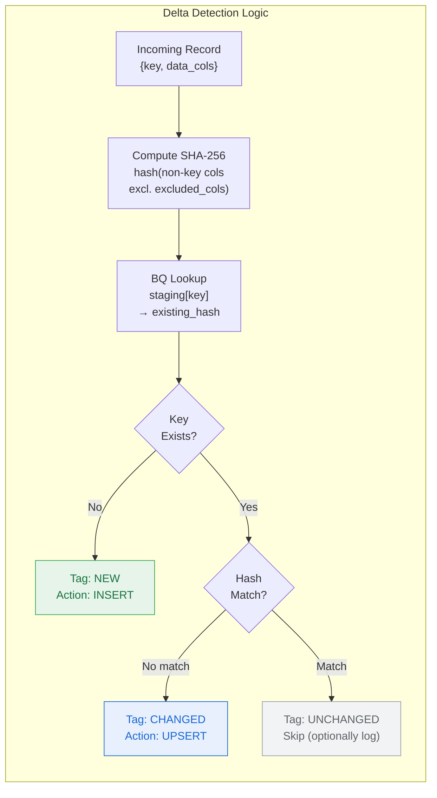
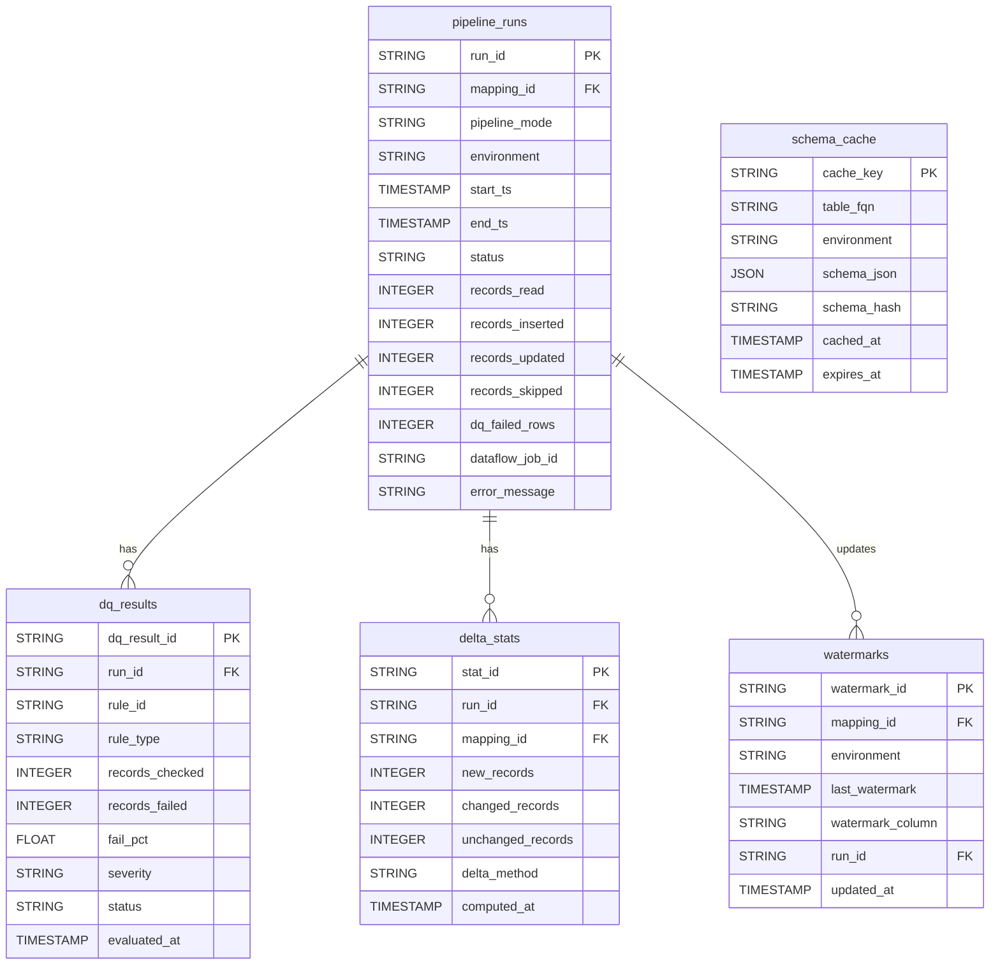
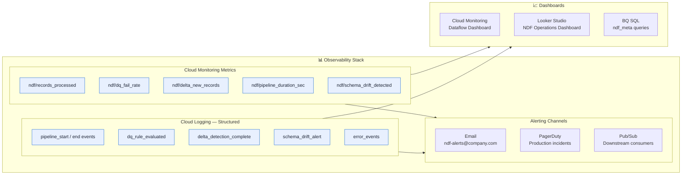
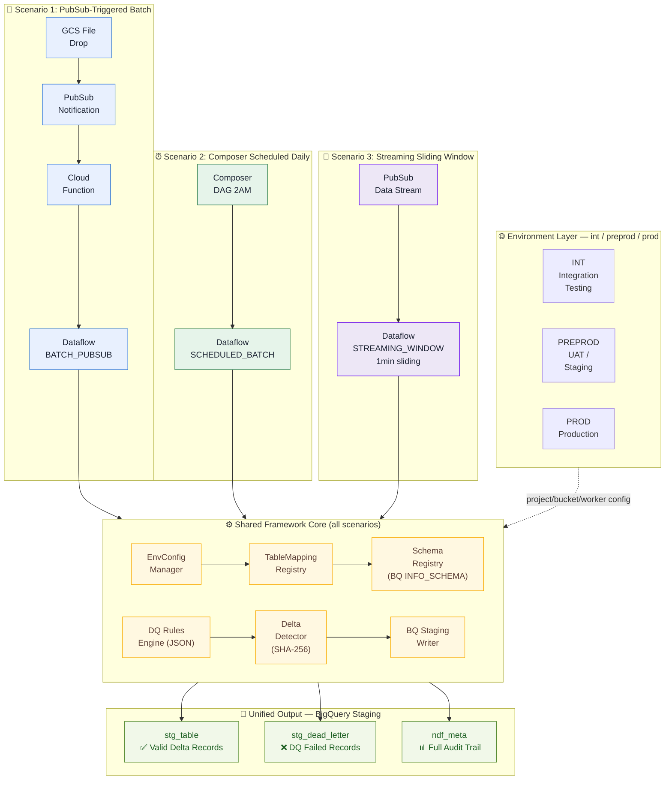

# ⚡ Nexus Dataflow Framework (NDF)

> **Unified Apache Beam on Google Cloud** · v1.0.0 · Apache Beam 2.55

A production-grade, schema-agnostic unified data processing framework built on Apache Beam and Google Cloud Dataflow. Supports event-driven batch ingestion, scheduled delta processing, and real-time sliding-window streaming from a single configurable runtime — for any table, any schema, any environment.

**Technology Stack:** `Google Dataflow` · `Apache Beam 2.55` · `BigQuery` · `Cloud PubSub` · `Cloud Composer` · `Dataplex DQ` · `GCS Config Store`

---

## Table of Contents

- [Overview](#overview)
- [Master Architecture](#master-architecture)
- [Framework Core](#framework-core)
- [Scenario 1 — PubSub-Triggered Batch from GCS](#scenario-1--pubsub-triggered-batch-from-gcs)
- [Scenario 2 — Composer-Scheduled Daily BQ Delta Sync](#scenario-2--composer-scheduled-daily-bq-delta-sync)
- [Scenario 3 — PubSub Streaming with Sliding Windows](#scenario-3--pubsub-streaming-with-sliding-windows)
- [Schema Registry — BQ INFORMATION_SCHEMA](#schema-registry--bq-information_schema)
- [Table Mapping Registry](#table-mapping-registry)
- [DQ Rules Engine — JSON Configuration](#dq-rules-engine--json-configuration)
- [Delta Detection Engine](#delta-detection-engine)
- [Environment Configuration — INT / PREPROD / PROD](#environment-configuration--int--preprod--prod)
- [NDF Metadata Dataset — BigQuery](#ndf-metadata-dataset--bigquery)
- [Pipeline Factory — Flex Template Entry Point](#pipeline-factory--flex-template-entry-point)
- [Observability, Monitoring & Alerting](#observability-monitoring--alerting)
- [Error Handling & Retry Strategy](#error-handling--retry-strategy)
- [Deployment Guide](#deployment-guide)

---

## Overview

### What is Nexus Dataflow Framework?

NDF (Nexus Dataflow Framework) is a **single, unified Apache Beam runtime** that handles three distinct data processing patterns — event-triggered batch loading, scheduler-driven delta sync, and real-time windowed streaming — through a shared pipeline factory, schema registry, DQ engine, and delta detector.

| Metric | Value |
|---|---|
| Scenarios Covered | 3 |
| DQ Rule Types | 10 |
| Environments | 3 (INT / PREPROD / PROD) |
| Schema Source | BQ INFORMATION_SCHEMA |
| Config Format | JSON |
| Delta Strategy | SHA-256 + Key MERGE |

### Scenario Summary

| # | Name | Trigger | Mode |
|---|---|---|---|
| 1 | **Event-Triggered Batch** | PubSub message on GCS file arrival | `BATCH_PUBSUB` |
| 2 | **Composer-Scheduled Daily** | Cloud Composer DAG (daily) | `SCHEDULED_BATCH` |
| 3 | **Sliding Window Stream** | Continuous PubSub data stream | `STREAMING_WINDOW` |

### Design Philosophy

> Every component is driven by configuration (JSON + BQ metadata), not code. To onboard a new table, you add a mapping entry and DQ rule file — **zero pipeline code changes needed**.

**Key principles:**
- **Schema-Agnostic** — all schemas fetched dynamically from BQ INFORMATION_SCHEMA at runtime. No schema files to maintain.
- **Config-Driven** — adding a new table requires only a JSON mapping + DQ rules file.
- **Single Runtime** — one Dataflow Flex Template handles all three scenarios via the `--pipeline_mode` flag.

---

## Master Architecture

### Fig 1 — Complete Architecture (All Three Scenarios)



*All three trigger paths converge into a single Pipeline Factory, share the same Beam transforms, and write to the same staging layer.*

### Architectural Layers

| Layer | Responsibility | Technology |
|---|---|---|
| **Trigger** | Initiates pipeline execution | PubSub, Composer, Eventarc |
| **Config** | Runtime parameters, mappings, DQ rules | GCS JSON, BQ tables |
| **Factory** | Creates the right pipeline per scenario | Python / Apache Beam SDK |
| **Transforms** | Read, parse, validate, detect, write | Apache Beam PTransforms |
| **Sink** | BigQuery staging writes (INSERT/UPSERT) | BigQuery Storage Write API |
| **Metadata** | Audit trail, DQ results, lineage | BigQuery ndf_meta dataset |

---

## Framework Core

### Core Components & Module Architecture

The internal module design of NDF — each component is independently testable and configurable.

| Module | Class | Responsibility |
|---|---|---|
| `nexus.factory` | `PipelineFactory` | Entry point. Mode dispatch, Dataflow runner config injection, template parameter validation |
| `nexus.schema` | `SchemaRegistry` | Fetches BQ INFORMATION_SCHEMA, caches in `ndf_meta.schema_cache`, converts to Beam + BQ schema |
| `nexus.mapping` | `TableMappingRegistry` | Loads mapping JSON from GCS, resolves source → staging FQN per env, wildcard table support |
| `nexus.dq` | `DQRulesEngine` | Loads JSON rules from GCS, applies as Beam DoFn, routes failures to dead-letter, logs DQ audit |
| `nexus.delta` | `DeltaDetector` | SHA-256 hash compare, BQ staging key lookup, watermark management for streams |
| `nexus.config` | `EnvConfigManager` | Resolves project IDs, GCS buckets, BQ datasets, PubSub subscriptions, worker configs per env |

### Component Details

**`nexus.factory.PipelineFactory`**
- Mode dispatch: `BATCH_PUBSUB` / `SCHEDULED_BATCH` / `STREAMING_WINDOW`
- Dataflow runner config injection
- Template parameter validation

**`nexus.schema.SchemaRegistry`**
- `COLUMNS` + `COLUMN_FIELD_PATHS` support
- Nested / RECORD types
- TTL-based cache invalidation (default 1 hour)

**`nexus.mapping.TableMappingRegistry`**
- Multi-env mapping resolution
- Composite delta key support
- Partition column routing

**`nexus.dq.DQRulesEngine`**
- 10 built-in rule types
- Custom SQL rules via BQ
- Row-level + aggregate checks
- DQ result audit logging

**`nexus.delta.DeltaDetector`**
- SHA-256 content hashing
- BQ streaming read of staging keys
- Watermark management for streams

**`nexus.config.EnvConfigManager`**
- YAML/JSON env configs
- Secret Manager integration
- Worker sizing per env

### Fig 2 — Internal Beam Transform Chain



*Single pipeline for all scenarios. Mode-specific behavior injected via DoFn configuration.*

---

## Scenario 1 — PubSub-Triggered Batch from GCS

> **Mode:** `BATCH_PUBSUB`
> Event-driven architecture: GCS file arrival triggers PubSub notification → Dataflow job launches → loads file → DQ → delta → staging write.

### Processing Steps

```
GCS File Arrives  →  PubSub Notified  →  Dataflow Launched  →  DQ + Delta  →  Write Staging
 (objectFinalize)    (Topic message)     (Flex Template)       (Validate)      (BQ UPSERT)
```

### Fig 3 — Scenario 1 Architecture



*GCS object finalize event → PubSub → Cloud Function → Dataflow job launch.*

### PubSub Trigger Message Schema

```json
{
  "mapping_id": "MAP_ORDERS_001",
  "environment": "prod",
  "gcs_uri": "gs://ndf-landing-prod/orders/2024-01-15/orders_full.parquet",
  "file_format": "parquet",
  "file_size_bytes": 45231890,
  "arrival_ts": "2024-01-15T08:23:11Z",
  "source_system": "erp_oracle",
  "checksum_md5": "a3f2b891c4e5d6789012...",
  "run_id": "RUN-20240115-082311-7f3a"
}
```

### Supported File Formats

| Format | Reader | Schema Detection | Compression | Notes |
|---|---|---|---|---|
| **Parquet** | `beam.io.ReadFromParquet` | Auto from file + BQ INFO_SCHEMA override | snappy, gzip, zstd | Preferred for large files |
| **Avro** | `beam.io.ReadFromAvro` | Embedded Avro schema | deflate, snappy | Schema evolution supported |
| **CSV** | `beam.io.ReadFromText` | BQ INFO_SCHEMA mandatory | gzip | Header row skip configured |
| **JSON (NDJSON)** | `beam.io.ReadFromText` | BQ INFO_SCHEMA for type cast | gzip | One JSON object per line |
| **ORC** | Custom DoFn (PyArrow) | ORC metadata + BQ override | zlib, snappy | Beta support |

---

## Scenario 2 — Composer-Scheduled Daily BQ Delta Sync

> **Mode:** `SCHEDULED_BATCH`
> Cloud Composer orchestrates a nightly Dataflow job: reads BQ source table, compares with staging snapshot, writes only changed/new records.

### Fig 4 — Scenario 2 Architecture



*Airflow DAG controls pre-conditions, launch, wait, and post-audit. Dataflow uses BQ Storage Read API for high-throughput source table reads.*

### Composer DAG — Python Code

```python
from airflow import DAG
from airflow.providers.google.cloud.operators.dataflow import DataflowStartFlexTemplateOperator
from airflow.providers.google.cloud.sensors.dataflow import DataflowJobStatusSensor
from airflow.providers.google.cloud.operators.bigquery import BigQueryInsertJobOperator
from datetime import datetime, timedelta
import uuid

MAPPING_IDS = [
    "MAP_ORDERS_001", "MAP_CUSTOMERS_002",
    "MAP_PRODUCTS_003", "MAP_INVENTORY_004"
]

with DAG(
    dag_id="ndf_daily_delta_sync",
    schedule_interval="0 2 * * *",  # 2 AM daily
    start_date=datetime(2024, 1, 1),
    catchup=False,
    default_args={
        "retries": 2,
        "retry_delay": timedelta(minutes=5),
        "email_on_failure": True,
        "email": ["ndf-alerts@company.com"]
    },
    tags=["ndf", "delta", "scheduled"],
) as dag:

    for mapping_id in MAPPING_IDS:
        run_id = f"RUN-{{ds_nodash}}-{mapping_id}-{uuid.uuid4().hex[:6]}"

        launch = DataflowStartFlexTemplateOperator(
            task_id=f"launch_{mapping_id}",
            project_id="{{ var.value.ndf_project_id }}",
            location="us-central1",
            body={
                "launchParameter": {
                    "jobName": f"ndf-{mapping_id.lower()}-{{{{ ds_nodash }}}}",
                    "containerSpecGcsPath": "gs://ndf-templates/nexus-flex-template.json",
                    "parameters": {
                        "pipeline_mode": "SCHEDULED_BATCH",
                        "mapping_id": mapping_id,
                        "environment": "{{ var.value.ndf_environment }}",
                        "execution_date": "{{ ds }}",
                        "run_id": run_id,
                    }
                }
            }
        )

        wait = DataflowJobStatusSensor(
            task_id=f"wait_{mapping_id}",
            job_id=f"{{{{ task_instance.xcom_pull('{launch.task_id}')['id'] }}}}",
            expected_statuses={"JOB_STATE_DONE"},
            project_id="{{ var.value.ndf_project_id }}",
            location="us-central1",
            poke_interval=60,
            timeout=7200,
        )

        launch >> wait
```

> **Parallelism:** Multiple `mapping_id`s run as parallel Dataflow jobs within the same DAG run. Each job is fully independent — separate Dataflow workers, separate BQ write sessions, separate audit rows.

---

## Scenario 3 — PubSub Streaming with Sliding Windows

> **Mode:** `STREAMING_WINDOW`
> Continuous data ingestion via PubSub — processed in 1-minute sliding windows using Apache Beam's streaming engine with watermarks and allowed lateness.

### Fig 5 — Scenario 3 Architecture



*Beam's streaming engine processes messages in 1-min sliding windows (30s slide). Watermark + allowed lateness handles out-of-order events.*

### Sliding Window Configuration — Python

```python
import apache_beam as beam
from apache_beam import window

# Sliding window: 60s size, 30s slide
# e.g. window [00:00-01:00], [00:30-01:30] ...
windowed = (
    messages
    | "AssignEventTimestamp" >> beam.Map(
        lambda x: beam.window.TimestampedValue(
            x, x["event_timestamp"]
        )
    )
    | "SlidingWindow" >> beam.WindowInto(
        window.SlidingWindows(
            size=60,    # 1 minute window
            period=30   # emit every 30 seconds
        ),
        trigger=trigger.AfterWatermark(
            late=trigger.AfterCount(1)
        ),
        allowed_lateness=30,
        accumulation_mode=trigger.AccumulationMode.DISCARDING
    )
)
```

### Stream Message Schema

```json
{
  "mapping_id": "MAP_ORDERS_STREAM_001",
  "event_type": "INSERT",
  "event_timestamp": "2024-01-15T08:23:11.453Z",
  "source_system": "order_service_v2",
  "payload": {
    "order_id": "ORD-90234",
    "customer_id": "CUST-1023",
    "amount": 1250.99,
    "status": "confirmed"
  },
  "metadata": {
    "producer_id": "order-svc-pod-3a",
    "msg_seq": 89234,
    "schema_version": "v2.3"
  }
}
```

> **Deduplication within Window:** Within each sliding window, the `WindowAggregate` transform groups by delta key and takes the latest record by `event_timestamp`, ensuring at-most-once semantics per key per window before hitting the DeltaDetector.

---

## Schema Registry — BQ INFORMATION_SCHEMA

All table schemas are fetched dynamically from BigQuery's `INFORMATION_SCHEMA`. No static schema files. The registry caches results in `ndf_meta.schema_cache` with configurable TTL.

### Fig 6 — Schema Resolution Flow



*Cache-first approach reduces BQ metadata API calls in repeated pipeline runs.*

### INFORMATION_SCHEMA Discovery Query

```sql
-- Fetch full schema including nested/repeated fields
SELECT
  c.table_catalog,
  c.table_schema,
  c.table_name,
  c.column_name,
  c.ordinal_position,
  c.is_nullable,
  c.data_type,
  c.is_partitioning_column,
  c.clustering_ordinal_position,
  cf.field_path,
  cf.data_type      AS nested_data_type,
  cf.description
FROM
  `{project}.{dataset}.INFORMATION_SCHEMA.COLUMNS` c
LEFT JOIN
  `{project}.{dataset}.INFORMATION_SCHEMA.COLUMN_FIELD_PATHS` cf
    ON c.table_name = cf.table_name
    AND c.column_name = cf.column_name
WHERE
  c.table_name = @table_name
ORDER BY
  c.ordinal_position, cf.field_path
```

### Schema Cache Table (`ndf_meta.schema_cache`)

| Column | Type | Description |
|---|---|---|
| `cache_key` | STRING | MD5(project+dataset+table+env) — partition key |
| `table_fqn` | STRING | Fully-qualified table name (project.dataset.table) |
| `environment` | STRING | int / preprod / prod |
| `schema_json` | JSON | Full BQ TableSchema as JSON string |
| `beam_schema_json` | JSON | Serialized Beam schema |
| `column_count` | INTEGER | Number of top-level columns |
| `has_nested` | BOOL | True if RECORD/REPEATED types present |
| `cached_at` | TIMESTAMP | Cache population time |
| `expires_at` | TIMESTAMP | TTL expiry (default: cached_at + 1 hour) |
| `schema_hash` | STRING | SHA-256 of schema_json — drift detection |

> **Schema Drift Detection:** On each cache refresh, the new `schema_hash` is compared to the previous. If drift is detected, an alert is raised via Cloud Monitoring and the pipeline pauses until the mapping owner acknowledges the change.

---

## Table Mapping Registry

Every source-to-staging relationship is declared in the central mapping registry JSON stored in GCS. A single mapping entry drives all three scenario modes.

### Mapping Registry JSON Schema

```json
// gs://ndf-config-{env}/mappings/registry.json
{
  "registry_version": "2.0",
  "last_updated": "2024-01-15T10:00:00Z",
  "updated_by": "ndf-admin@company.com",
  "mappings": [
    {
      "mapping_id": "MAP_ORDERS_001",
      "display_name": "Orders Table — Full Delta Sync",
      "enabled": true,
      "scenario_modes": ["BATCH_PUBSUB", "SCHEDULED_BATCH"],

      "source": {
        "project_ref": "ENV.source_project",       // resolved per env
        "dataset": "raw_data",
        "table": "orders",
        "gcs_prefix": "orders/",                   // for BATCH_PUBSUB
        "file_format": "parquet",
        "partition_filter": "DATE(created_at) = @execution_date"
      },

      "staging": {
        "project_ref": "ENV.staging_project",
        "dataset": "staging",
        "table": "stg_orders",
        "partition_column": "_partition_date",
        "partition_type": "DAY",
        "clustering_fields": ["customer_id", "status"],
        "write_mode": "UPSERT"                     // UPSERT | APPEND | REPLACE
      },

      "delta_keys": ["order_id"],                  // composite: ["order_id","line_id"]
      "hash_columns": "__all_non_key__",            // or list of specific columns
      "exclude_from_hash": ["updated_at", "_ingest_ts"],

      "dq_rules_path": "gs://ndf-config-{env}/dq_rules/orders_dq.json",
      "dq_fail_strategy": "QUARANTINE",            // QUARANTINE | FAIL_JOB | WARN
      "dq_fail_threshold_pct": 5,

      "watermark_column": "updated_at",
      "watermark_table": "ndf_meta.watermarks",

      "metadata_columns": {
        "add_ingest_ts": true,                     // adds _ingest_ts TIMESTAMP
        "add_run_id": true,                        // adds _run_id STRING
        "add_source_file": true,                   // adds _source_file STRING
        "add_delta_action": true                   // adds _delta_action: NEW|CHANGED
      },

      "streaming_config": {                        // only for STREAMING_WINDOW mode
        "pubsub_subscription": "ndf-orders-stream-sub",
        "window_size_seconds": 60,
        "window_period_seconds": 30,
        "allowed_lateness_seconds": 30,
        "dedup_within_window": true
      }
    }
  ]
}
```

### Mapping Field Reference

| Field | Type | Required | Description |
|---|---|---|---|
| `mapping_id` | STRING | ✅ Required | Unique identifier, used in all trigger payloads and Composer params |
| `scenario_modes` | STRING[] | ✅ Required | `BATCH_PUBSUB`, `SCHEDULED_BATCH`, `STREAMING_WINDOW` |
| `delta_keys` | STRING[] | ✅ Required | Composite primary key for delta detection. Must match BQ PK semantics. |
| `hash_columns` | STRING[]\|`"__all_non_key__"` | ⚠️ Recommended | Columns included in SHA-256 hash for change detection |
| `dq_rules_path` | STRING | ⚠️ Recommended | GCS path to DQ rules JSON. `{env}` is substituted at runtime. |
| `partition_filter` | STRING | Optional | BQ parameterized query filter for Scenario 2 source reads |
| `watermark_column` | STRING | Optional | Column used for watermark-based incremental reads |
| `exclude_from_hash` | STRING[] | Optional | Columns excluded from SHA-256 (audit fields, timestamps that always change) |

---

## DQ Rules Engine — JSON Configuration

Each table has its own DQ rules JSON file stored in GCS. Rules are loaded at pipeline startup, compiled into a Beam `DQValidatorDoFn`, and applied per-element. Aggregate rules (row count, distribution) run as post-window checks.

### DQ Rule Types

| Rule Type | Scope | Description |
|---|---|---|
| `NOT_NULL` | Row-Level | Checks that specified columns are not NULL or empty string. Config: `columns` (list), `treat_empty_as_null` |
| `UNIQUENESS` | Row-Level | Validates uniqueness of a column or composite key within the batch/window. Config: `columns`, `scope`: BATCH\|WINDOW\|GLOBAL |
| `RANGE` | Row-Level | Validates numeric, date, or string length falls within min/max. Config: `column`, `min`, `max`, `data_type`: NUMERIC\|DATE\|STRING_LEN |
| `REGEX_PATTERN` | Row-Level | Validates column values match a given regular expression. Config: `column`, `pattern`, `error_msg` |
| `REFERENTIAL_INTEGRITY` | Cross-table | Checks FK values exist in a referenced BQ table. Config: `column`, `ref_table` (BQ FQN), `ref_column`, `ignore_nulls` |
| `ROW_COUNT_THRESHOLD` | Aggregate | Validates batch row count within expected min/max (detects empty loads/explosions). Config: `min_rows`, `max_rows` |
| `FRESHNESS_CHECK` | Aggregate | Validates MAX timestamp column is not older than threshold. Config: `column`, `max_age_hours`, `severity` |
| `ALLOWED_VALUES` | Row-Level | Validates column value is in a predefined set (enum). Config: `column`, `allowed` (list), `case_sensitive` |
| `CUSTOM_SQL` | Aggregate | Executes parameterized BQ SQL against a temp batch table. Config: `sql` (BQ SQL, `@batch_table` injected), `expected_result` |
| `STATISTICAL_DISTRIBUTION` | Aggregate | Compares column mean/stddev/percentiles against historical baseline. Config: `column`, `z_score_threshold`, `baseline_window_days` |

### Sample DQ Rules JSON — Orders Table

```json
// gs://ndf-config-{env}/dq_rules/orders_dq.json
{
  "table_ref": "orders",
  "dq_version": "1.4",
  "fail_fast": false,
  "rules": [
    {
      "rule_id": "R-001",
      "name": "OrderID Must Not Be Null",
      "type": "NOT_NULL",
      "severity": "ERROR",
      "columns": ["order_id", "customer_id"],
      "treat_empty_as_null": true
    },
    {
      "rule_id": "R-002",
      "name": "OrderID Uniqueness",
      "type": "UNIQUENESS",
      "severity": "ERROR",
      "columns": ["order_id"],
      "scope": "BATCH"
    },
    {
      "rule_id": "R-003",
      "name": "Amount Range Check",
      "type": "RANGE",
      "severity": "ERROR",
      "column": "amount",
      "min": 0.01,
      "max": 9999999.99,
      "data_type": "NUMERIC"
    },
    {
      "rule_id": "R-004",
      "name": "Status Allowed Values",
      "type": "ALLOWED_VALUES",
      "severity": "WARN",
      "column": "status",
      "allowed": ["pending", "confirmed", "shipped", "cancelled", "returned"],
      "case_sensitive": false
    },
    {
      "rule_id": "R-005",
      "name": "Customer FK Check",
      "type": "REFERENTIAL_INTEGRITY",
      "severity": "WARN",
      "column": "customer_id",
      "ref_table": "ENV.staging_project.staging.stg_customers",
      "ref_column": "customer_id",
      "ignore_nulls": true
    },
    {
      "rule_id": "R-006",
      "name": "Row Count Guard",
      "type": "ROW_COUNT_THRESHOLD",
      "severity": "ERROR",
      "min_rows": 1,
      "max_rows": 10000000
    },
    {
      "rule_id": "R-007",
      "name": "Data Freshness",
      "type": "FRESHNESS_CHECK",
      "severity": "WARN",
      "column": "updated_at",
      "max_age_hours": 26
    }
  ],
  "fail_threshold_pct": 5,
  "quarantine_table": "staging.stg_orders_dead_letter",
  "alert_on_fail": true,
  "alert_channel": "projects/{project}/notificationChannels/ndf-dq-alerts"
}
```

---

## Delta Detection Engine

NDF uses a SHA-256 content hash strategy combined with key-based lookup against the staging table. This is faster than full row comparison and works for any number of columns without code changes.

### Fig 7 — Delta Detection Logic



*SHA-256 hash comparison avoids full column-level diffing. Works for any schema width.*

### Hash Computation — Python

```python
import hashlib, json

def compute_row_hash(
    record: dict,
    delta_keys: list,
    exclude_cols: list
) -> str:
    # Remove key columns + excluded
    non_key = {
        k: v for k, v in record.items()
        if k not in delta_keys
        and k not in exclude_cols
    }
    # Deterministic serialization
    serialized = json.dumps(
        non_key,
        sort_keys=True,
        default=str  # handles datetime, Decimal
    ).encode("utf-8")
    return hashlib.sha256(serialized).hexdigest()

def build_composite_key(
    record: dict,
    delta_keys: list
) -> str:
    return "||".join(
        str(record[k]) for k in sorted(delta_keys)
    )
```

### NDF Metadata Columns Added to Staging Table

| Column | Type | Description |
|---|---|---|
| `_ndf_hash` | STRING | SHA-256 of non-key columns |
| `_ndf_ingest_ts` | TIMESTAMP | When record was written to staging |
| `_ndf_run_id` | STRING | Pipeline run ID that wrote this row |
| `_ndf_delta_action` | STRING | `NEW` \| `CHANGED` \| `BACKFILL` |
| `_ndf_source_file` | STRING | GCS URI (Scenario 1 only) |
| `_ndf_window_start` | TIMESTAMP | Window start (Scenario 3 only) |
| `_ndf_window_end` | TIMESTAMP | Window end (Scenario 3 only) |

> **Staging Table MERGE Pattern (Scenario 2):** For scheduled batch, the delta detector loads the full set of staging keys + hashes into a Beam side-input dictionary before processing source records. This avoids per-record BQ lookups and runs at Beam batch speed.

---

## Environment Configuration — INT / PREPROD / PROD

All environment-specific values (project IDs, worker sizes, GCS buckets, subscriptions) are centralized per environment. The mapping registry uses `ENV.*` variable references that are substituted at runtime.

### Environment Config JSON

```json
// gs://ndf-config-{env}/environments/{env}.json

{
  // ── INT (Integration Testing) ─────────────────────────────────────
  "int": {
    "environment": "int",
    "source_project": "my-company-int",
    "staging_project": "my-company-int",
    "ndf_meta_project": "my-company-int",
    "ndf_meta_dataset": "ndf_meta_int",
    "gcs_config_bucket": "ndf-config-int",
    "gcs_landing_bucket": "ndf-landing-int",
    "gcs_temp_bucket": "ndf-temp-int",
    "bq_location": "US",
    "dataflow_region": "us-central1",
    "dataflow_subnetwork": "regions/us-central1/subnetworks/ndf-int-subnet",
    "worker_machine_type": "n1-standard-4",
    "max_workers": 10,
    "num_workers": 2,
    "use_public_ips": false,
    "service_account": "ndf-worker-int@my-company-int.iam.gserviceaccount.com",
    "kms_key": null,
    "secret_manager_prefix": "projects/my-company-int/secrets/ndf"
  },

  // ── PREPROD ───────────────────────────────────────────────────────
  "preprod": {
    "environment": "preprod",
    "source_project": "my-company-preprod",
    "staging_project": "my-company-preprod",
    "ndf_meta_project": "my-company-preprod",
    "ndf_meta_dataset": "ndf_meta_preprod",
    "gcs_config_bucket": "ndf-config-preprod",
    "gcs_landing_bucket": "ndf-landing-preprod",
    "gcs_temp_bucket": "ndf-temp-preprod",
    "bq_location": "US",
    "dataflow_region": "us-central1",
    "dataflow_subnetwork": "regions/us-central1/subnetworks/ndf-preprod-subnet",
    "worker_machine_type": "n1-standard-8",
    "max_workers": 30,
    "num_workers": 5,
    "use_public_ips": false,
    "service_account": "ndf-worker-preprod@my-company-preprod.iam.gserviceaccount.com",
    "kms_key": "projects/my-company-preprod/locations/us-central1/keyRings/ndf/cryptoKeys/ndf-key",
    "secret_manager_prefix": "projects/my-company-preprod/secrets/ndf"
  },

  // ── PROD ──────────────────────────────────────────────────────────
  "prod": {
    "environment": "prod",
    "source_project": "my-company-prod",
    "staging_project": "my-company-prod",
    "ndf_meta_project": "my-company-prod",
    "ndf_meta_dataset": "ndf_meta_prod",
    "gcs_config_bucket": "ndf-config-prod",
    "gcs_landing_bucket": "ndf-landing-prod",
    "gcs_temp_bucket": "ndf-temp-prod",
    "bq_location": "US",
    "dataflow_region": "us-central1",
    "dataflow_subnetwork": "regions/us-central1/subnetworks/ndf-prod-subnet",
    "worker_machine_type": "n1-standard-16",
    "max_workers": 100,
    "num_workers": 10,
    "use_public_ips": false,
    "service_account": "ndf-worker-prod@my-company-prod.iam.gserviceaccount.com",
    "kms_key": "projects/my-company-prod/locations/us-central1/keyRings/ndf/cryptoKeys/ndf-key",
    "secret_manager_prefix": "projects/my-company-prod/secrets/ndf"
  }
}
```

### Environment Comparison

| Setting | INT | PREPROD | PROD |
|---|---|---|---|
| Worker Type | n1-standard-4 | n1-standard-8 | n1-standard-16 |
| Max Workers | 10 | 30 | 100 |
| Initial Workers | 2 | 5 | 10 |
| KMS Encryption | ❌ None | ✅ CMEK | ✅ CMEK |
| Public IPs | ✅ Optional | ❌ No | ❌ No |
| DQ Fail Strategy | WARN | QUARANTINE | QUARANTINE / FAIL_JOB |
| Alerting | Email only | Email + PagerDuty | Email + PagerDuty + Slack |
| Data Retention | 7 days | 30 days | 365 days (BQ partitioned) |

---

## NDF Metadata Dataset — BigQuery

All framework metadata (run history, DQ results, delta stats, schema cache, watermarks) is stored in the `ndf_meta` BigQuery dataset. This enables full operational observability via BQ SQL.

### Fig 8 — Metadata Schema (ER Diagram)



*Full lineage from every run, DQ evaluation, and delta detection operation.*

---

## Pipeline Factory — Flex Template Entry Point

The Pipeline Factory is the single Dataflow Flex Template entry point. It reads the pipeline mode from job parameters and constructs the appropriate Beam pipeline graph.

```python
import apache_beam as beam
from apache_beam.options.pipeline_options import PipelineOptions
from nexus.config import EnvConfigManager
from nexus.mapping import TableMappingRegistry
from nexus.schema import SchemaRegistry
from nexus.transforms import (
    ReadGCSTransform, ReadBQTransform, ReadPubSubTransform,
    ParseSchemaTransform, DQValidatorTransform,
    DeltaDetectorTransform, StagingWriteTransform,
    AuditLoggerTransform
)


class NexusPipelineOptions(PipelineOptions):
    @classmethod
    def _add_argparse_args(cls, parser):
        parser.add_argument("--pipeline_mode",
            choices=["BATCH_PUBSUB", "SCHEDULED_BATCH", "STREAMING_WINDOW"])
        parser.add_argument("--mapping_id")
        parser.add_argument("--environment", choices=["int", "preprod", "prod"])
        parser.add_argument("--run_id")
        parser.add_argument("--execution_date", default=None)
        parser.add_argument("--gcs_uri", default=None)


class PipelineFactory:
    def __init__(self, opts: NexusPipelineOptions):
        self.opts = opts
        self.env_cfg = EnvConfigManager(opts.environment)
        self.mapping = TableMappingRegistry(self.env_cfg).get(opts.mapping_id)
        self.schema = SchemaRegistry(self.env_cfg).get_schema(
            self.mapping.source_table_fqn
        )

    def build_and_run(self):
        if self.opts.pipeline_mode == "BATCH_PUBSUB":
            return self._run_batch_pubsub()
        elif self.opts.pipeline_mode == "SCHEDULED_BATCH":
            return self._run_scheduled_batch()
        elif self.opts.pipeline_mode == "STREAMING_WINDOW":
            return self._run_streaming_window()

    def _run_batch_pubsub(self):
        with beam.Pipeline(options=self.opts) as p:
            result = (
                p
                | "ReadGCS"    >> ReadGCSTransform(self.mapping, self.schema)
                | "ParseSchema" >> ParseSchemaTransform(self.schema)
                | "DQValidate"  >> DQValidatorTransform(self.mapping)
                | "DeltaDetect" >> DeltaDetectorTransform(self.mapping, self.env_cfg)
                | "WriteStaging" >> StagingWriteTransform(self.mapping, self.env_cfg)
            )
            result | "Audit" >> AuditLoggerTransform(self.opts.run_id, self.env_cfg)
        return result

    def _run_scheduled_batch(self):
        with beam.Pipeline(options=self.opts) as p:
            result = (
                p
                | "ReadBQ"      >> ReadBQTransform(self.mapping, self.opts.execution_date)
                | "ParseSchema" >> ParseSchemaTransform(self.schema)
                | "DQValidate"  >> DQValidatorTransform(self.mapping)
                | "DeltaDetect" >> DeltaDetectorTransform(self.mapping, self.env_cfg)
                | "WriteStaging" >> StagingWriteTransform(self.mapping, self.env_cfg)
            )
        return result

    def _run_streaming_window(self):
        stream_cfg = self.mapping.streaming_config
        with beam.Pipeline(options=self.opts) as p:
            result = (
                p
                | "ReadPubSub"   >> ReadPubSubTransform(self.mapping)
                | "SlidingWindow" >> beam.WindowInto(
                    beam.window.SlidingWindows(
                        size=stream_cfg["window_size_seconds"],
                        period=stream_cfg["window_period_seconds"]
                    )
                  )
                | "ParseSchema"  >> ParseSchemaTransform(self.schema)
                | "DQValidate"   >> DQValidatorTransform(self.mapping)
                | "DedupeWindow" >> beam.combiners.Latest.PerKey()
                | "DeltaDetect"  >> DeltaDetectorTransform(self.mapping, self.env_cfg)
                | "WriteStaging" >> StagingWriteTransform(self.mapping, self.env_cfg)
            )
        return result


if __name__ == "__main__":
    opts = NexusPipelineOptions()
    PipelineFactory(opts).build_and_run()
```

---

## Observability, Monitoring & Alerting

### Fig 9 — Observability Stack



### Custom Cloud Monitoring Metrics

| Metric Name | Type | Alert Threshold | Description |
|---|---|---|---|
| `ndf/records_processed` | COUNTER | — | Total records processed per run, labelled by mapping_id + env |
| `ndf/dq_fail_rate` | GAUGE | > 5% → CRITICAL | Percentage of records failing any DQ rule |
| `ndf/delta_new_records` | COUNTER | > 500k → WARN | Count of new records written to staging (unexpected spikes) |
| `ndf/pipeline_duration_sec` | GAUGE | > SLA_sec → WARN | End-to-end Dataflow job duration |
| `ndf/schema_drift_detected` | COUNTER | > 0 → CRITICAL | Schema hash changed vs last cached version |
| `ndf/dead_letter_count` | COUNTER | > 0 → ERROR | Records routed to dead-letter table |
| `ndf/watermark_lag_sec` | GAUGE | > 120s → WARN | Streaming watermark lag vs wall clock (Scenario 3) |

> **Operations Dashboard (Looker Studio):** A pre-built Looker Studio template connects directly to `ndf_meta` and surfaces: daily run summary table, DQ pass/fail trend, delta volume by table over time, schema drift history, and dead-letter queue growth charts.

---

## Error Handling & Retry Strategy

| Failure Type | Strategy | Details |
|---|---|---|
| **DQ Failures** | QUARANTINE | Failed records routed to per-table dead-letter BQ table. Pipeline continues unless fail rate exceeds threshold. |
| **Transient BQ Failures** | Exponential backoff | 3 retries: 30s → 90s → 270s with jitter. After exhaustion, Dataflow retries the bundle. |
| **Schema Drift** | Pause + Alert | Schema hash comparison on cache refresh. Pipeline pauses, stakeholders notified. Manual gate before resume. |
| **PubSub Message Failures** | Nack + DLQ topic | Malformed messages nacked and routed to DLQ PubSub topic. Cloud Function monitors DLQ accumulation. |
| **GCS Read Failures** | Fail Fast | Missing/corrupted GCS files trigger immediate pipeline failure with structured error log. Composer retries. |
| **Idempotency** | run_id guard | Each run carries a unique `run_id`. Re-running with the same `run_id` is safe — delta detection detects duplicate attempts and skips safely. |

---

## Deployment Guide

### GCS Folder Structure

```
gs://ndf-config-{env}/
├── environments/
│   ├── int.json
│   ├── preprod.json
│   └── prod.json
├── mappings/
│   └── registry.json          # master mapping registry
├── dq_rules/
│   ├── orders_dq.json
│   ├── customers_dq.json
│   └── {table}_dq.json        # one per table
└── templates/
    └── nexus-flex-template.json

gs://ndf-landing-{env}/        # raw file drops (Scenario 1)
├── orders/
│   └── 2024-01-15/
│       └── orders_full.parquet
└── {source}/

gs://ndf-temp-{env}/           # Dataflow temp/staging
└── dataflow/

gs://ndf-templates/            # Flex Template images
├── nexus-flex-template.json
└── nexus-flex-template-{version}.json
```

### Cloud Build CI/CD Pipeline

```yaml
# cloudbuild.yaml
steps:
  - name: 'python:3.11'
    id: 'run-tests'
    entrypoint: bash
    args: ['-c', 'pip install -r requirements.txt && pytest tests/ -v']

  - name: 'gcr.io/cloud-builders/docker'
    id: 'build-image'
    args:
      - build
      - -t
      - gcr.io/$PROJECT_ID/nexus-dataflow:$SHORT_SHA
      - -f Dockerfile.flex
      - .

  - name: 'gcr.io/cloud-builders/docker'
    id: 'push-image'
    args:
      - push
      - gcr.io/$PROJECT_ID/nexus-dataflow:$SHORT_SHA

  - name: 'gcr.io/google.com/cloudsdktool/cloud-sdk'
    id: 'build-flex-template'
    args:
      - gcloud
      - dataflow
      - flex-template
      - build
      - gs://ndf-templates/nexus-flex-template.json
      - --image=gcr.io/$PROJECT_ID/nexus-dataflow:$SHORT_SHA
      - --sdk-language=PYTHON
      - --metadata-file=flex_template_metadata.json

  - name: 'gcr.io/google.com/cloudsdktool/cloud-sdk'
    id: 'upload-configs'
    args:
      - bash
      - -c
      - gsutil -m rsync -r config/ gs://ndf-config-${_ENV}/
```

### IAM Roles Required

| Service Account | Roles | Purpose |
|---|---|---|
| `ndf-worker-{env}@` | `dataflow.worker`, `bigquery.dataEditor`, `storage.objectViewer`, `pubsub.subscriber`, `secretmanager.secretAccessor` | Dataflow worker SA — reads GCS, writes BQ, reads PubSub |
| `ndf-composer-{env}@` | `dataflow.developer`, `iam.serviceAccountUser` (on worker SA) | Composer DAG SA — launches Dataflow jobs |
| `ndf-trigger-{env}@` | `dataflow.developer`, `iam.serviceAccountUser` (on worker SA) | Cloud Function SA — launches Dataflow from PubSub trigger |
| `ndf-build-{env}@` | `storage.admin`, `dataflow.developer`, `cloudbuild.builds.builder`, `containerregistry.ServiceAgent` | Cloud Build SA — builds and publishes Flex Template |

### Onboarding a New Table

> 1. Add a mapping entry to `registry.json`
> 2. Create a DQ rules JSON file at `gs://ndf-config-{env}/dq_rules/{table}_dq.json`
> 3. Ensure the target staging table exists in BQ (or set `auto_create_staging: true` in mapping)
> 4. Test in **INT** → promote to **PREPROD** → promote to **PROD**
>
> **No pipeline code changes needed.**

---

## End-to-End Summary

### Fig 10 — All Scenarios Unified View



*All three scenarios converge into the same shared framework core and write to the same BigQuery staging layer.*

---

## Version Info

| Property | Value |
|---|---|
| Framework Version | 1.0.0 |
| Document Version | v1.0 |
| Apache Beam | 2.55 |
| Platform | Google Cloud Dataflow |
| Environments | INT · PREPROD · PROD |
| Design | Schema-agnostic, config-driven, multi-scenario |
